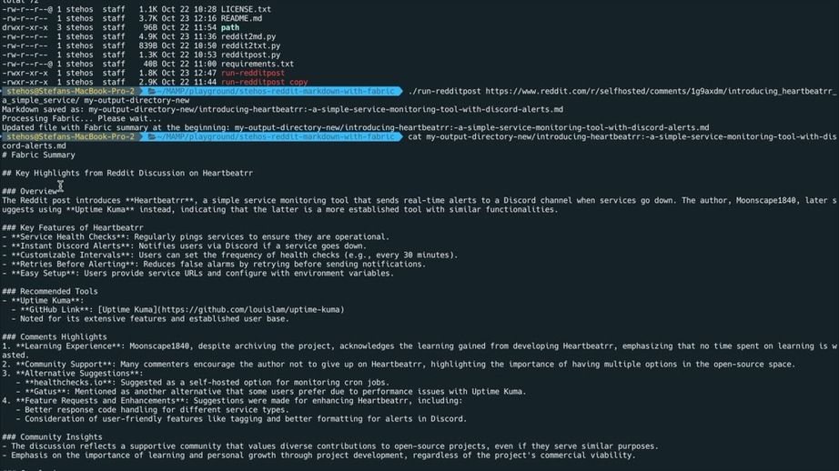

# Stehos Reddit Markdown With Fabric


## Description
A simple tool to extract text from Reddit posts, convert them into markdown files, and process them with Fabric. The tool uses multiple Python scripts to achieve this.

### iTerm in action


### iOS Shortcut in action


## Apple Shortcut for Reddit App Integration
To launch this directly from your iPhone via SSH, use the following link: [Apple Shortcut - Reddit to Markdown](https://www.icloud.com/shortcuts/5c37b952172445238cccb42d7813d00b).

## CLI Usage
To run the main script, use the following command:

```bash
./run-redditpost.sh <reddit_url> <output_directory> [pattern_name]
```

### Arguments
- **reddit_url**: The URL of the Reddit post to process.
- **output_directory**: Directory to save the generated markdown file.
- **pattern_name** (optional): Fabric pattern name for summaries; defaults to `summarize`. Use `"0"` to skip Fabric processing.

### Script Insights
**run-redditpost.sh**

This shell script orchestrates the process by:
- Validating input arguments.
- Activating a Python virtual environment.
- Running `redditpost.py` to retrieve Reddit text and convert it to markdown.
- Adding Fabric summaries to the markdown file if a pattern name is provided (and not `"0"`).

**redditpost.py**
- Handles argument parsing for URL, output path, and pattern name.
- Runs `reddit2txt.py` to fetch text content from Reddit.
- Passes the output to `reddit2md.py` to convert text into a markdown file.

**reddit2txt.py**
- Uses Reddit API credentials to extract text from a specified Reddit post URL.

Ensure you have the following environment variables for Reddit API access in your `.env` or shell environment:

- `REDDIT_CLIENT_ID`
- `REDDIT_CLIENT_SECRET`
- `REDDIT_USER_AGENT`

**reddit2md.py**
- Converts the plain text from `reddit2txt.py` into markdown, including post title, author, upvotes, body, and comments.

## Requirements
1. [Fabric](https://github.com/danielmiessler/fabric) installed and configured for summaries.
2. Python 3.x with required packages (install via pip).
3. Reddit API credentials for access.

## Installation

1. Install Fabric and [generate](https://github.com/NFeruch/reddit2text) your Reddit API credentials.
2. Clone this repository to your server.
3. Create a virtual environment in your app folder: `python3 -m venv path/to/venv`.
4. Activate the environment via `source path/to/venv/bin/activate`.
5. Install dependencies: `pip3 install -r requirements.txt`.
6. Update `~/.bash_profile` or `~/.zshrc` to run the script from anywhere:
   - Add: `export PATH=$PATH:/path/to/your/cloned/folder`.

Run the script with:

```bash
run-redditpost.sh https://www.reddit.com/r/selfhosted/comments/1g8jytd/best_firewall_for_debian/ ./test
```

### Notes
To use a custom Fabric pattern, change the `pattern_name` argument in the `run-redditpost.sh` command. You can add new custom patterns in `~/.config/fabric/my_patterns`.

## License

This project is licensed under the MIT License. See the [LICENSE](LICENSE.txt) file for details.

## Support

[](https://ko-fi.com/stehos)

# Changelog - 30.10.2024

### Added
- Support for an optional third argument `pattern_name` in `run-redditpost.sh`. This allows specifying a custom Fabric pattern for processing summaries, defaulting to `"summarize"` if no pattern is provided.
- Condition to skip Fabric processing if `pattern_name` is set to `"0"`.
- Updated usage instructions for `run-redditpost.sh` to reflect new syntax:
  ```bash
  ./run-redditpost.sh <reddit_url> <output_directory> [pattern_name]
  ```